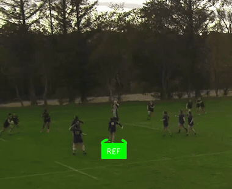
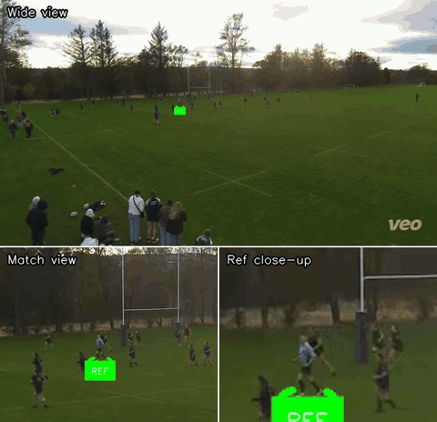
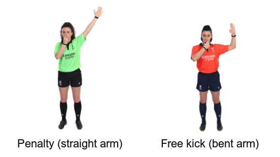
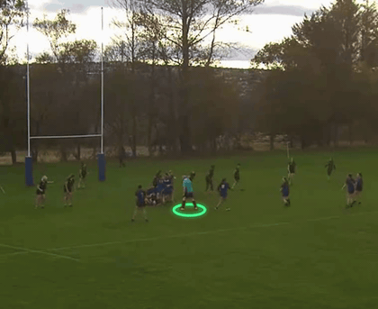
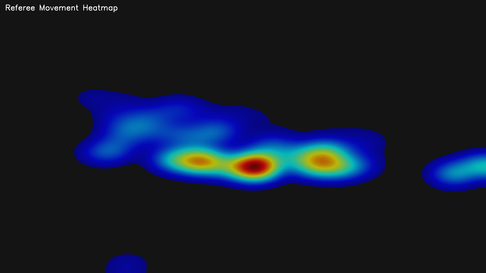

# RefTracker

Tracks the on-field referee in amateur rugby footage, classifies decisions against the official World Rugby signal vocabulary, and produces an annotated video with a structured decision log.

**Use cases:** post-match analysis for teams (what was called, when, and why), referee development review, and building a structured decision dataset for season-level statistics.

<p align="center">
  
</p>

*Smooth ref-centred follow-cam: the disc stays locked to the **cyan-kitted referee** through open play, and a banner names and explains each call. (Decision labels are verified — see [accuracy](#current-accuracy--findings).)*

## What it does

1. **Tracks the referee** in wide-angle match footage — two approaches: a **colour-first** single-object tracker (recommended when the ref's kit colour is unique — most cases) and a YOLOv8 + BoTSORT + CLIP-ReID tracker (fallback). Both auto-calibrate the ref's exact kit colour.
2. **Classifies decisions** by sending *ref-centred zoom* clips to Gemini with official World Rugby signal reference images — penalties, try / no-try (including the signalled-then-reversed "held up"), free kicks, etc.
3. **Overlays** an underfoot disc marker + decision banners onto the video, with an optional ref-centred **follow-cam**.
4. **Measures itself** — an eval harness scores tracking and decisions (with a detection-vs-classification split) so changes are measured, not eyeballed.

### Referee tracking — colour-first underfoot disc

The **cyan-kitted referee** is ~40 pixels tall in the original 1920×1080 Veo footage. The three panels below show the same 8-second sequence at the full wide view, a match-area zoom, and a close-up — all from a single colour-first tracking pass with no multi-object identity tracker.

<p align="center">
  
</p>

*The disc stays correctly locked to the cyan ref even with similarly-coloured navy and black-kitted players in frame. Genuine occlusions (breakdown piles) correctly show no disc.*

### Decision classification against the official signals

Short ref-centred zoom clips are sent to **Gemini 3.5 Flash** together with the official World Rugby hand-signal references (the full set lives in [`signals/`](signals/)). Many calls differ by a single detail — a **penalty** is a straight raised arm, a **free kick** a bent one:

<p align="center">
  
</p>

The finished render names and explains each call:

<p align="center">
  
</p>

*Finished render with verified labels. This call is a **free kick** (bent, right-angled arm); the classifier mislabelled it a penalty — that straight-vs-bent-arm distinction is below the resolution floor at ~40px. See [accuracy](#current-accuracy--findings).*

### Referee movement heatmap

The tracker records referee screen position throughout the match and renders it as a density heatmap — useful for understanding which areas see the most referee attention.

<p align="center">
  
</p>

> **Caveat:** this maps *screen* position, not pitch position. On fixed-camera footage (locked tripod) it gives a genuine spatial picture. On auto-panning cameras like Veo, the camera follows play, so screen position doesn't correspond to a fixed pitch location — the heatmap is then misleading and should be disregarded.

## Architecture

```
Video Input (wide-angle Veo footage; often SILENT — Veo records mic-off by default)
    |
    +-> TRACK THE REF (LOCAL, on laptop)
    |   +-- track_ref_colour.py  (recommended for a colour-UNIQUE ref):
    |   |     per-frame YOLOv8 person detection -> pick the torso matching the
    |   |     ref's auto-calibrated unique kit colour -> interpolate short gaps.
    |   |     No multi-object tracker (no identity to maintain when the colour
    |   |     is unique); genuine occlusions correctly show NO marker.
    |   +-- track_ref.py  (fallback for non-separable colour):
    |         YOLOv8 + BoTSORT (CLIP-ReID) + auto-calibrated tight kit-colour
    |         range + camera-aware colour re-acquire (+ --ref-start seed).
    |   +-- Output: annotated .mp4 (disc marker), tracking .json, heatmap .png
    |
    +-> CLASSIFY DECISIONS (CLOUD API - Gemini 3.5 Flash)
    |   +-- Feeds Gemini a ref-CENTRED ZOOM (the wide ref is ~40px, unreadable)
    |   +-- Short per-decision windows (one long pass under-reports)
    |   +-- 16 official signal images + no_try/held_up vocab + reversal reasoning
    |   +-- Returns timestamped decision JSON
    |
    +-> merge_output.py (LOCAL - OpenCV)
    |   +-- Draws the disc (from a tracking JSON) + decision banners
    |   +-- --follow / --follow-zoom: smooth ref-centred follow-cam render
    |   +-- Output: final annotated .mp4
    |
    +-> evaluate.py (LOCAL) — score tracking + decisions vs hand-labelled truth
    +-> detect_whistle.py (LOCAL) — whistle detector for the two-pass design
        (only usable where the footage has audio)
```

## Trackers — colour-first vs BoTSORT

**Key finding:** when the referee's shirt is a colour *no player wears*, a multi-object identity tracker (BoTSORT) is the wrong tool — there is no identity to maintain, and its identity-drift can stick the marker to the wrong player. For that common case, just **detect the colour every frame**:

- **`track_ref_colour.py` (recommended).** Per frame: detect all people, score each torso against the ref's auto-calibrated unique hue, pick the best (with a light smoothness nudge), interpolate brief gaps. On a hard test clip (pale-blue ref, navy teams, ~40px, wide panorama) it put the marker on the *correct* ref at 88% disc coverage where the BoTSORT path locked a navy player.
- **`track_ref.py` (fallback).** YOLOv8 + BoTSORT + CLIP-ReID. Auto-calibrates a *tight* colour range from the identified ref's own torso pixels — this fixes the root cause of earlier failures: in dim footage the grass inside every bounding box reads as "green", so a generic colour range can't tell the ref from a player on grass. Camera-aware re-acquire; `--ref-start X,Y` seeds the ref by location when colour auto-ID is ambiguous.

## Decision classification

- The ref is too small at full frame for Gemini to read his hands, so we feed a **ref-centred zoom** built from the tracking. Classify in **short per-decision windows** — a single long pass under-reports.
- Vocabulary includes `no_try` / `held_up`, with explicit guidance to watch for the *arm-up-then-reversal* (a signalled try waved off after inspection).
- On a labelled 1m40s test sequence, given correctly-anchored windows: **3/4 decisions correct** (penalty, try, no-try/held-up). The one miss — penalty vs free kick — differs *only* by the elbow bend (straight vs bent arm), which is below the resolution floor at ~40px.

### Two-pass direction (reviewed, partly built)

Detect decision **moments** first (cheap, high-recall), then classify only those windows:
- **Detection** wants the *whistle* (audible through the pile, where vision/tracking fail) or a full-frame play-change cue — *not* the ref's pixels. `detect_whistle.py` is a non-ML whistle detector (ffmpeg + scipy STFT band-energy + persistence), validated on footage that has audio. **Caveat:** Veo records mic-off by default, so most footage is silent — detection then stays visual or manual.
- **Tracking** runs only on the candidate windows (it's the expensive stage, and it breaks exactly at the occluded breakdowns where decisions cluster — the main open problem).

## Eval harness

`evaluate.py` keeps changes honest:
- **Tracking:** extract labelled stills, mark `1`/`-1`/`0` (on-ref / wrong-person / nothing), score strict accuracy.
- **Decisions:** score predictions vs ground truth with a **detection-recall vs classification-accuracy split**, false-positive `_not_decisions` traps, and a time-base mismatch guard.

## Setup

```bash
git clone git@github.com:dznicol/reftracker.git
cd reftracker
uv sync

# Gemini API key (free at https://aistudio.google.com/apikey)
echo "GOOGLE_API_KEY=your-key-here" > .env
# Model weights auto-download on first run
```

## Usage

```bash
# 1a. Track the ref by his UNIQUE colour (recommended)  — --hue is a wide HSV
#     band to find him; --imgsz 1280 helps with small/distant refs
uv run python src/track_ref_colour.py videos/your_match.mp4 \
  --output output/tracked.mp4 --hue 75 99 --imgsz 1280

# 1b. ...or the BoTSORT tracker (fallback for non-unique colours)
uv run python src/track_ref.py videos/your_match.mp4 \
  --output output/tracked.mp4 --ref-colour green --marker disc

# 2. Classify decisions with Gemini (feed a ref-centred / tracked clip)
uv run python src/classify_decisions.py output/tracked.mp4 \
  --output output/decisions.json --ref-marker disc --ref-colour green --model gemini-3.5-flash

# 3. Finished render — disc (from the tracking JSON) + decision banners.
#    Add --follow [--follow-zoom 1.4] for a smooth ref-centred follow-cam.
uv run python src/merge_output.py videos/your_match.mp4 output/decisions.json \
  --tracking-json output/tracked.json --output output/final.mp4 --follow

# Measure it
uv run python src/evaluate.py tracking-template output/tracked.mp4 --frames 40
uv run python src/evaluate.py score-tracking output/<...>/eval/tracking_labels.csv
uv run python src/evaluate.py decisions-template
uv run python src/evaluate.py score-decisions output/decisions.json <truth>.json --detect-tolerance 5
```

### Referee colour options

`--ref-colour` supports: `green`, `black`, `yellow`, `red`, `blue`, `cyan`, `white`.
The tracker then auto-tightens to the ref's *actual* shade. For a colour that isn't separable, use `track_ref_colour.py --hue <lo> <hi>`.

## Current accuracy / findings

### Tracking
- **Colour-first** puts the marker on the correct ref at ~88% disc coverage on the hard pale-blue clip (vs the BoTSORT path locking the wrong player). Gaps are genuine breakdown occlusions, where the marker correctly disappears.
- The dominant earlier failure was *lock-stuck on the wrong player* (not invisibility), traced to grass-in-bbox inflating a generic green score — fixed by auto-calibrating a tight range from the ref's own kit.

### Decision classification
- Gemini reads decisions well **once the ref is zoomed and the window is short** — including the contested try→held-up reversal. The hard limit is *resolution*: distinctions that hinge on a few pixels (penalty's straight arm vs a free kick's bent arm) aren't reliable at ~40px.
- Team assignment is approximate (kit colour by side).

## Roadmap

### Performance analytics
- **Structured decision log** — export decisions as CSV/JSON with timestamp, type, and team for season-level aggregation: penalty counts, free-kick trends, try/no-try outcomes, patterns per opponent.
- **Match summary report** — per-team decision breakdown at the end of each run (total penalties against, free kicks awarded, cards).
- **Pitch-space heatmap** — homography-correct referee position onto a 2D pitch diagram instead of screen coordinates, so the heatmap is valid on panning footage too.

### Tracking & classification
- **Two-pass detect→classify** (reviewed design): detect decision *moments* first (whistle or play-change cue), then classify only those short windows. The remaining engineering is robustly anchoring an occluded ref through the breakdown — appearance-ReID or SAM-style segmentation.
- **Player-clustering for team assignment** — the side holding the most same-coloured players reveals which team occupies which half; would make the decision log team attribution automatic.

### Minor
- Migrate off the deprecated `google-generativeai` SDK to `google-genai`.

## Tech stack

- [YOLOv8](https://github.com/ultralytics/ultralytics) — person detection
- [BoxMOT](https://github.com/mikel-brostrom/boxmot) — BoTSORT tracking with CLIP-ReID (fallback path)
- [Supervision](https://github.com/roboflow/supervision) — visual annotations
- [OpenCV](https://opencv.org/) — video processing
- [SciPy](https://scipy.org/) — STFT for the whistle detector
- [Gemini 3.5 Flash](https://ai.google.dev/) — decision classification
- [uv](https://github.com/astral-sh/uv) — Python package management

## Documentation

- [Roadmap](docs/roadmap.md) — planned improvements and future directions
- [Technical Glossary](docs/glossary.md) — definitions of CV, tracking, and classification terms used in this project
- `CLAUDE.md` — quick command reference and working notes
